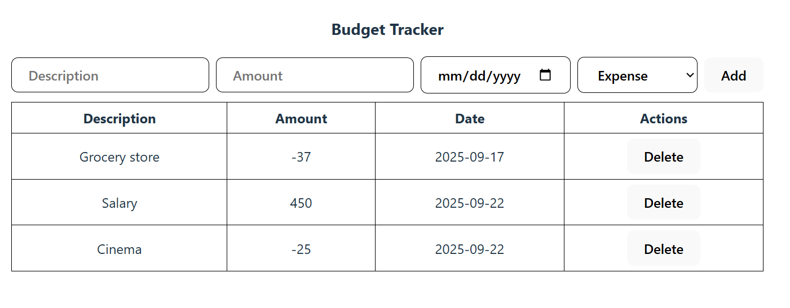
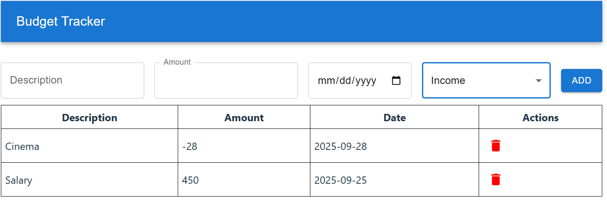
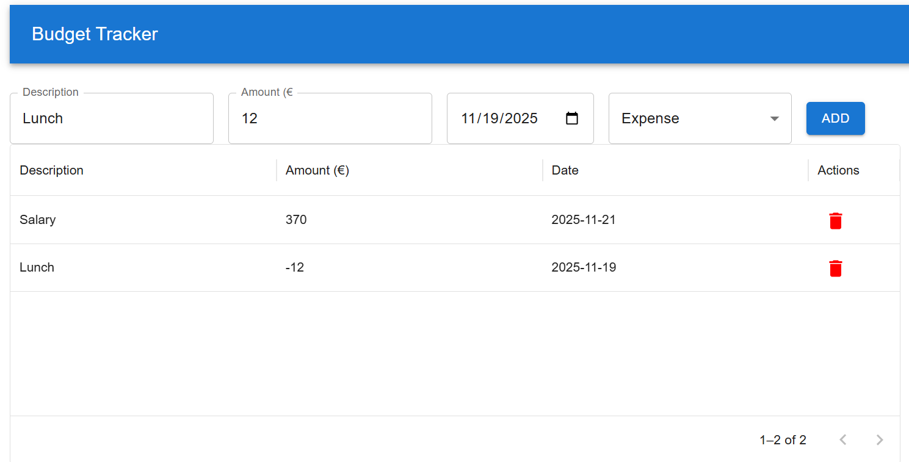
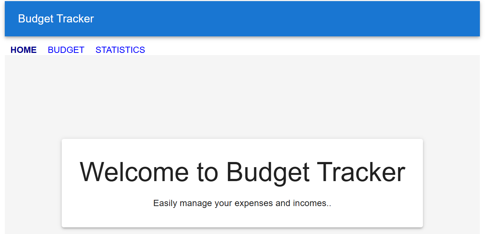
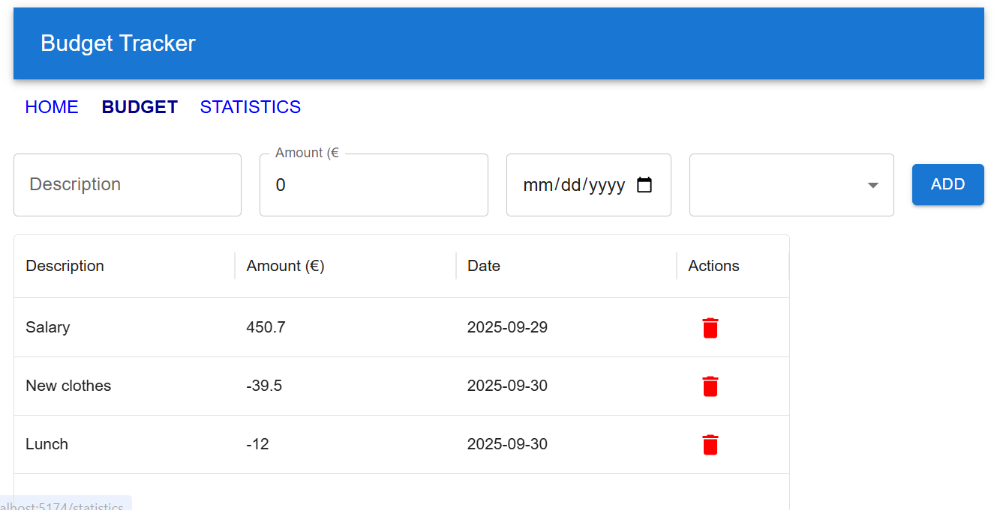

[Suomenkielinen tehtävänanto (README.fi.md)](README.fi.md)

# Budget Tracker (Total 12 points)

Create a simple Budget Tracker built with React and TypeScript. This assignment contains multiple steps (sub assignments) and these are divided to multiple weeks.

## Step 1 (3 points)
Step one can be started after the TodoList is implemented in the course

### Create a new component: `BudgetTracker`
In that component, implement a form that allows users to add budget items with the following fields:
- Description (string)
- Amount  (number)
- Type: either "Income" or "Expense"
- Date (string)

If the selected type is **Expense**, the amount should be saved as a negative value.

Add validation:
- All fields must be filled in.
- The amount must be a valid number (not empty, not negative, not NaN).

### Create a new component: `BudgetItems`
This component will be responsible for displaying the list of budget items in a table format. Show each item's description, amount and date in the table.

Include a "Delete" button for each row to remove items from the list. 

Receive the list of items and the delete handler via props from `BudgetTracker` component and display the `BudgetTracker` component in the `App` component.

### Usage and example screenshot
1. Enter a description, amount, date, and select the type (Income or Expense).
2. Click **Add** to add it to the table.
3. View all budget items in the table below. Use the **Delete** button to remove an expense.

### Bonus
- Display the current saldo (total balance) on the page, calculated as the sum of all budget item amounts.
- Monthly limit and alert.

## Step 2: Material UI (3 points)
Step two can be started after the Material UI is studied in the course. In this phase you'll enhance the Expense Tracker by using the Materia UI components.

First, create a new branch `step2`.

**Material UI components:**
- Create an app bar for the application that show the header text Budget Tracker
- Replace the `input` and `button` elements in the Expense Tracker with suitable Material UI components.
- Input elements and button should be horizontally aligned and add proper spacing and margins between each component to ensure user-friendly ui.

**Date Picker:**
- Replace the current date input field in the Expense Tracker with the MUI-X Date Picker (https://mui.com/x/react-date-pickers/date-picker/).
- In the table where expense entries are listed, format the displayed date in format `yyyy-mm-dd`.

## Step 3: Datagrid (3 points)

This step can be started after the MUI-X DataGrid is studied in the course. In this step, you will upgrade the budget item list display by replacing the basic HTML table with the MUI-X `DataGrid` component for improved functionality.
Remove the existing HTML table used to display budget item entries.

First, create a new branch `step3`.

- Implement the MUI-X `DataGrid` component to present the data instead.
- Configure appropriate columns, such as Title, Amount, Date, and any other relevant fields.
- Enable useful features like sorting, filtering, and pagination for better user experience.

### Bonus
- Show the amount in 🔴 red color for expense items and 🟢 green color for income items.
- Organize the DataGrid rows by type, grouping items into income and expense categories.

## Step 4: Routing (3 points)
This step can be started after the React Router is studied in the course.

First, create a new branch `step4`.

### Add Router

Install React Router to your project.

Implement a new component:
- `Home`: Displays a welcome message to users.

Implement routing that allows the user to navigate between the `Home` and `BudgetTracker` components.

> [!NOTE]
> If you notice that your expenses and incomes disappear when navigating between pages, it's likely because the data is stored in a component that gets unmounted when the route changes. Then, when it's mounted again, a new instance of the state is created.
>
> To fix this, try lifting the state up:
> Move the state that holds your budget to a higher-level component such as `App` so it stays in memory while switching between pages. Then, pass it down as props to the > > components that need it.
>
> You can read more about lifting state up in [React doucmentation](https://react.dev/learn/sharing-state-between-components)

Once your state is lifted to `App` component you can test that the data is persistent by adding a few budget items on the Budget page, navigating to the Home page, and then returning to the Budget page the items should still be there.

### Statistic

Finally, create a new component called `Statistic`.
It should display:
- Total income
- Total expenses
- Saldo (income – expenses)

Use the shared state to calculate and display these values. Then, update your routing so that the user can navigate between:
- Home
- BudgetTracker
- Statistics

#### Examples
Home screen:

Budget screen:

Statistics screen:

